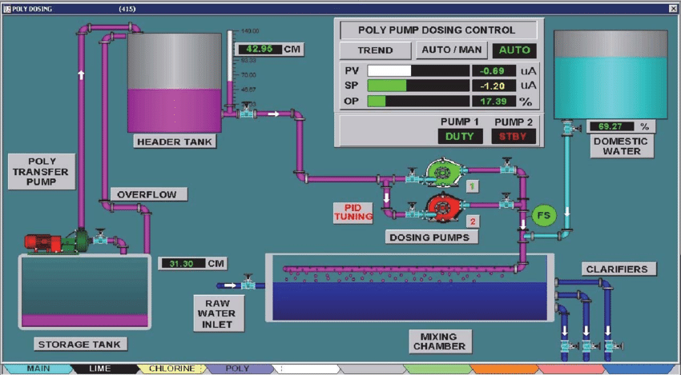
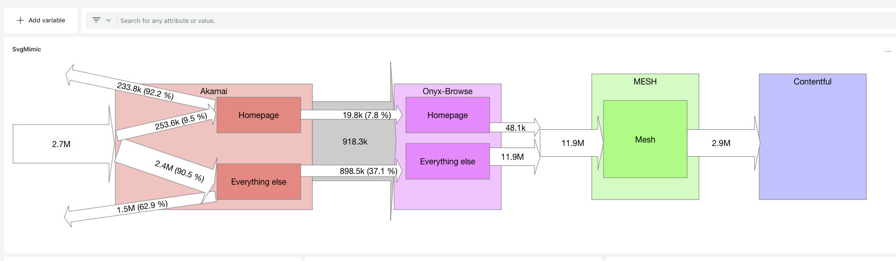
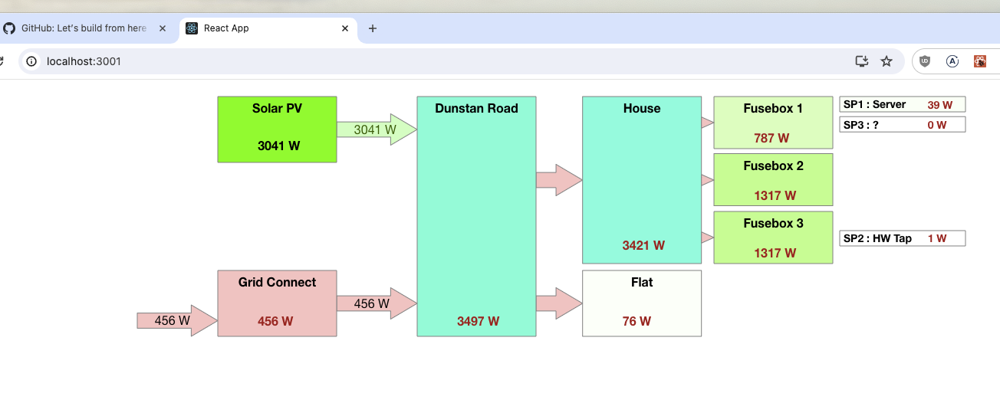

# SVG Mimics Cookbook

Do you find staring at a wall of numbers / graphs hard to build a mental model of what's going on (or, explaining them to other people is difficult) ?

Turns out this is exactly the problem SCADA systems have faced since the 80s, and their solution : build a control panel "mimic" that looks like the process you're controlling, with bits of UI that move around.

I find this sort of thing helps enormously to grok at a glance what is going on. And it's possible to DIY this stuff in many monitoring tools, if you know a minimal amount of react.

## Basic pattern

1) Draw a mimic in your favourite tool that can export as SVG (I use [Omnigraffle](https://www.omnigroup.com/omnigraffle/), but [Inkscape](https://inkscape.org) is FOSS).

2) Save it as an SVG

3) Strip out any xml namespace elements in the SVG as react won't like those

4) Create it as a simple react component that takes some props of the data you want to show. You can then replace various elements in your SVG with react-style `{prop.percentTraffic}` style things.

5) For bonus ponts, you can use bits of code to do things like hide/show bits of your mimic, change colours, etc. "The only limit is your imagination".

6) Wrap it up in a mechanism to display it in whatever your dashboarding tool does. 

## Some examples:

### New Relic

Turns out, New Relic has a very nice devex for creating "applications" or "nerdlets" (sic) which you can deploy into dashboards.

See https://developer.newrelic.com/build-apps

The [new_relic](./new_relic) Directory is one I conjured up to explain traffic load as it works its' way through a webstack. 

There's a couple of parts that may be useful - one is the use of  `import { timeRangeToNrql } from '@newrelic/nr-labs-components';` to make the mimic react to the time range the user has selected.

There are probably nicer ways of making multiple promise-style NRQL calls - I make no great claims at being a front-end dev and my aim was speed and not spending my life writing js.But you can see the above pattern in svc-mimic - index.js is all the new-relic specifics, and data.js is the visualisation SVG.

### Stand-alone web thing (in a docker container)

This is a mimic of the grid / solar distribution in my home (am I importing or exporting, etc).

It's the world's simplest react app just doing a periodic REST call to an OpenHAB instance, then using the data to drive an SVG. It's in the [power_panel](./power_panel) directory. 

Worst-case, you could host this in an iframe in your tool-of-choice. I actually embed this into my PKM tool - [Logseq](https://logseq.com) - by pasting an iframe reference so it appears in my home-automation notes (`<iframe src="http://my-webserver-svg:3000" style="width: 100%; height: 600px"></iframe>`)

